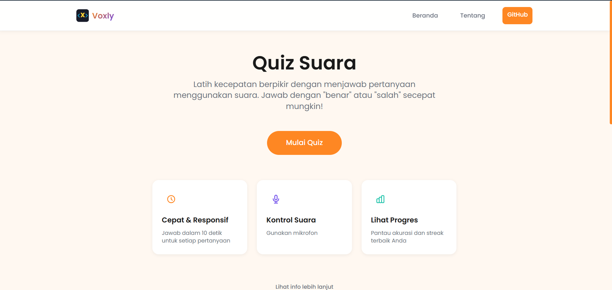

# Voxly 🗣️✨

**Voxly adalah sebuah kuis interaktif berbasis web di mana Anda menjawab pertanyaan hanya dengan menggunakan suara Anda.**

Proyek ini merupakan eksplorasi bagaimana *machine learning*, khususnya pengenalan suara, dapat diintegrasikan langsung di browser untuk menciptakan pengalaman pengguna yang unik dan menyenangkan.

[](https://voxly.anggapuspa.dev/)

### ➤ [Coba Live Demo di Sini!](https://voxly.anggapuspa.dev/)

---

## 🚀 Tentang Proyek Ini

Proyek ini berawal dari sebuah tugas mata kuliah **Kecerdasan Buatan**, yang kemudian dikembangkan menjadi sebuah website interaktif yang berfungsi penuh. Tujuannya adalah untuk membuktikan bahwa aplikasi AI yang kompleks dapat berjalan sepenuhnya di sisi pengguna (client-side) tanpa memerlukan server backend yang berat.

Model dilatih untuk mengenali dua perintah suara utama: **'Benar'** dan **'Salah'**, yang memungkinkan pengguna untuk berinteraksi dengan kuis secara hands-free.

## 🛠️ Teknologi yang Digunakan

* **[Teachable Machine](https://teachablemachine.withgoogle.com/)**: Digunakan untuk melatih model machine learning dalam mengenali sampel suara dengan mudah.
* **[TensorFlow.js](https://www.tensorflow.org/js)**: Berfungsi untuk menjalankan model AI yang sudah dilatih langsung di dalam browser.
* **HTML, CSS, & JavaScript**: Menjadi fondasi utama untuk membangun semua tampilan dan pengalaman interaktifnya.

## ⚙️ Cara Menjalankan Proyek Secara Lokal

Jika Anda ingin mencoba atau mengembangkannya sendiri, ikuti langkah-langkah berikut:

1.  **Clone repository ini:**
    ```sh
    git clone [https://github.com/nama-anda/voxly.git](https://github.com/nama-anda/voxly.git)
    ```
2.  **Buka folder proyek:**
    ```sh
    cd voxly
    ```
3.  **Jalankan file `index.html`:**
    * Cara termudah adalah dengan menggunakan ekstensi **Live Server** di Visual Studio Code. Ini penting untuk menghindari masalah CORS saat memuat model.
    * Atau, Anda bisa menggunakan server lokal sederhana dengan Python:
        ```sh
        python -m http.server
        ```
4.  Buka browser Anda dan akses `http://localhost:8000` (atau port yang sesuai).

## 🧑‍💻 Dibuat Oleh

* **Angga Puspa** - [anggapuspa](https://github.com/nama-anda)

---
*Proyek ini adalah bagian dari studi di mata kuliah Kecerdasan Buatan, Primakara University.*